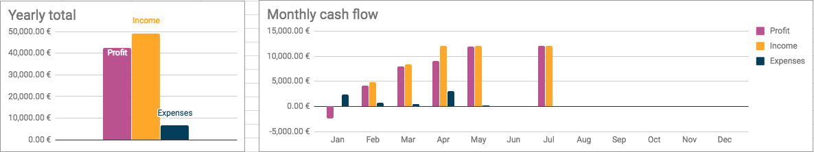

Having trouble keeping track of your company's cash flow numbers? 🙃 Drowning in 
boring Excel sheets full of detailed numbers, but failing to see the bigger
picture? 📖😕 Afraid of that upcoming tax / social insurance bill you're going to
have to pay? 💸😰 Well rest easy! 😎 With this DIY Accounting Starter Kit 🗄📒 you can
automatically visualise your company's cash flow 📈 and estimate your future fees. 😏

How do you use it? It's easy. You enter your income and expenses in a standard
accounting format spreadsheet and the taxes, social insurance and cash flow
diagrams are generated for you automatically.

## Features

- 📊 automatic generation of monthly income & expense graphs
- 🤖 built-in income tax (Einkommensteuer) and social insurance (SVA)
- 📟 handy formulas for VAT and personal salary calculation
- 🗺 bilingual terms in German and English
- 😺 no complicated software to learn – Google Sheets FTW!

## Constraints

- 🇦🇹 the rules inside are based on the Austrian tax system
(though they should be similar in other EU countries)
- 💼 for now the numbers are for sole proprietorships only (Gewerbeschein / Einzelunternehmen)
- 🤞 take everything inside with a grain of salt, as I'm not an accountant
(I consult a [tax advisor](http://www.diewt.at) for the real tax application)

## The price?

It's completely free! 🎉 When I was starting my sole proprietorship
in Austria in 2015, I wanted to have a tool like this to help me figure out
how to do my accounting, what the tax and social insurance costs are going to be
etc. The complicated documentation mostly in German offered by the WKO
didn't really help me much. Well, now that I've learned how these things work,
I decided to share a starter kit to help people who are in the same situation.

In return, I hope you can help me extend the template to more company types and
maybe even more countries – crowdsourcing for the EU startup ecosystem win. 🙂
Instructions for submitting improvements are inside the spreadsheet.

    

        <h2>Author: <a href="https://metakermit.com/">Dražen Lučanin</a></h2>

        
Software developer, data analyst, founder of
        <a href="https://punkrockdev.com/">Punk Rock Dev</a> and definitely
        not an accountant. Dražen's been navigating the sea of Austrian corporate
        paperwork since 2015 and believes that some common-sense templates
        like this should be accessible to everyone in the community.

    

    

        
    

## Get your copy for free!

Fill out your name and email below to get your copy of the
DIY Accounting Starter Kit and start tracking your business numbers today!
🤓📒📈

<!-- Begin MailChimp Signup Form -->

<form action="https://punkrockdev.us14.list-manage.com/subscribe/post?u=53aecd554422f8ec674b24a16&amp;id=d2c61c9268" method="post" id="mc-embedded-subscribe-form" name="mc-embedded-subscribe-form" class="validate" target="_blank" novalidate>
    

	<label for="mce-NAME">Name </label>
	<input type="text" value="" name="NAME" class="" id="mce-NAME">

	<label for="mce-EMAIL">Email Address </label>
	<input type="email" value="" name="EMAIL" class="required email" id="mce-EMAIL">

    <strong>Interests </strong>
    <ul><li><input type="checkbox" value="1" name="group[5691][1]" id="mce-group[5691]-5691-0" checked><label for="mce-group[5691]-5691-0">Accounting-Austria</label></li>
</ul>

	

		

		

	
    <!-- real people should not fill this in and expect good things - do not remove this or risk form bot signups-->
    
<input type="text" name="b_53aecd554422f8ec674b24a16_d2c61c9268" tabindex="-1" value="">

    
<input type="submit" value="Email me the kit!" name="subscribe" id="mc-embedded-subscribe" class="button accent-button">

    

</form>

<!--End mc_embed_signup-->

